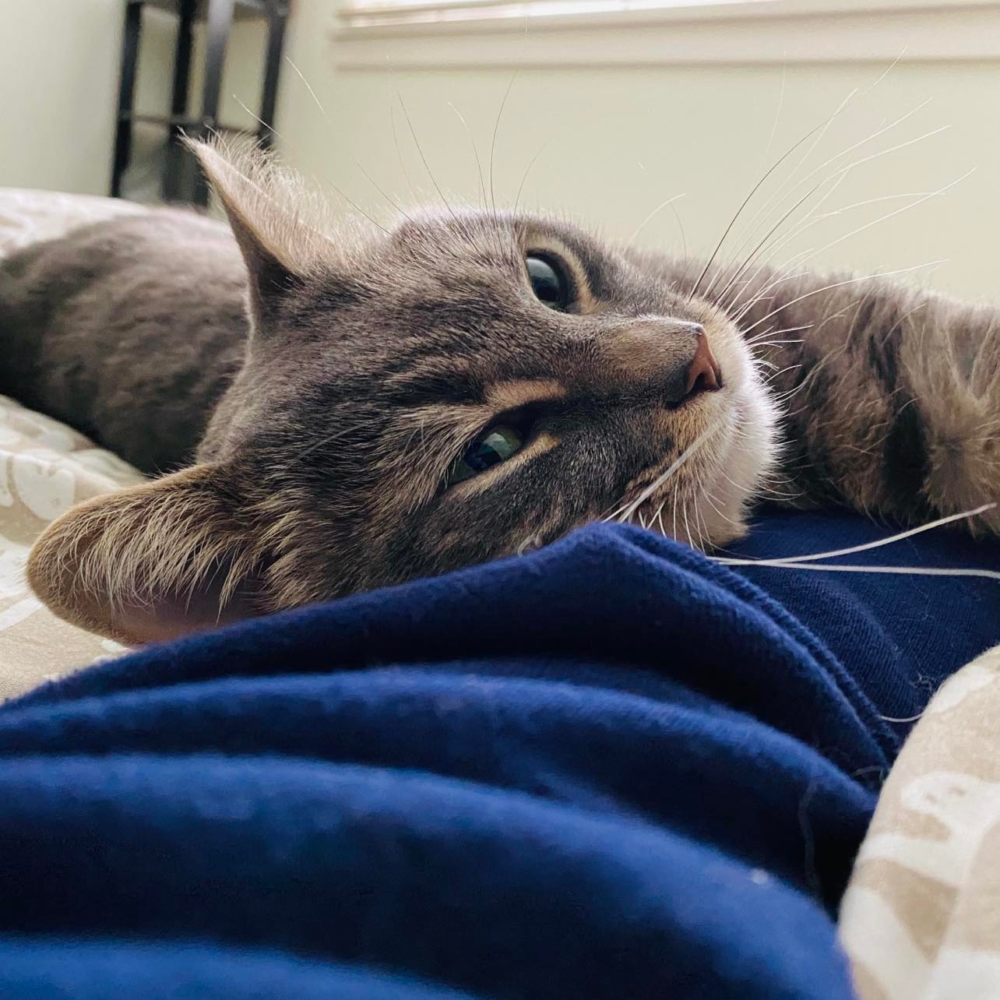

# This is Elaine's awesome website


Here's some text. I like the internet. I use [google](https://www.google.ca/) all the time to do data science.

This is my landlady's cat Grisou who is super adorable.




We can try to use html code to format the image instead of using rmd language. 

<center>

</center>

```{r}
library(tidyverse)

sample = rnorm(1000)
mean(sample)
```

Here's a direct link to the about page: [about](about.html).

I also made a bonus [extra page](extra_page.html).

## New Section!!

[Here's](plotly.html) a page with plotly plots.