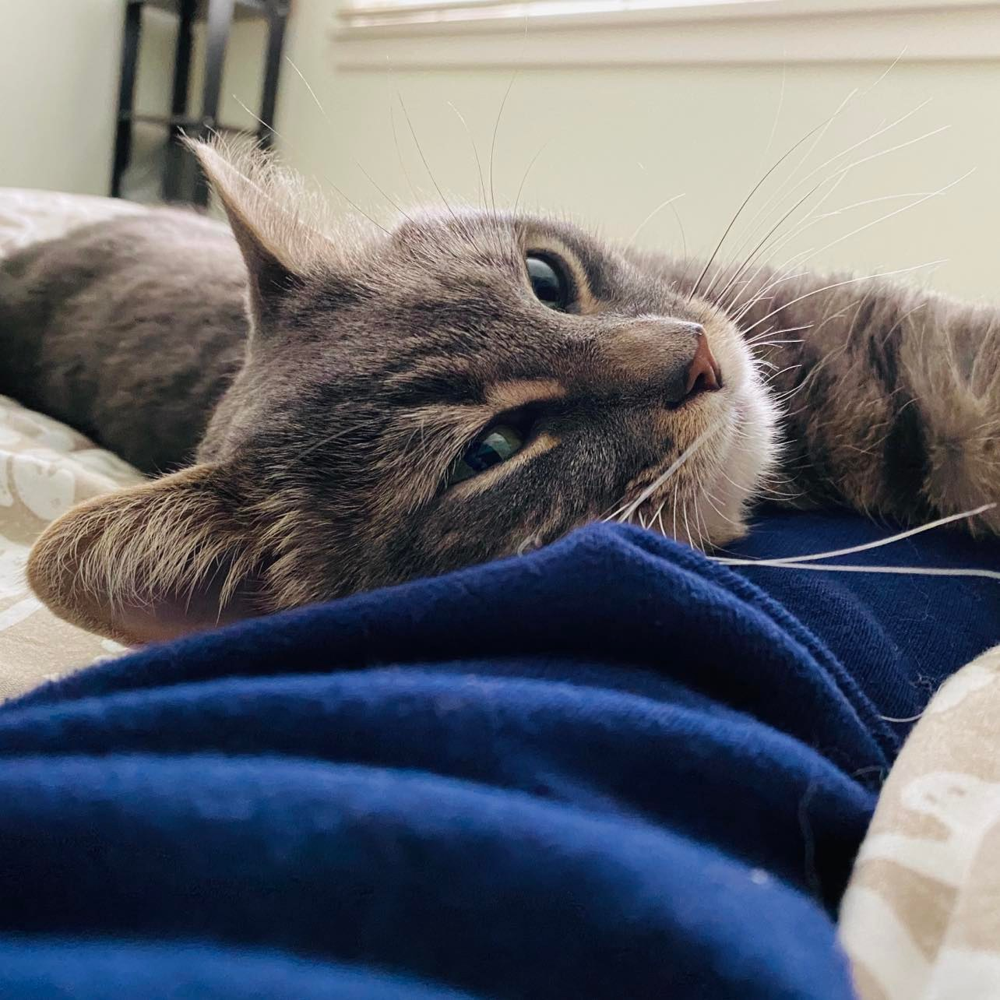

Hi, My name is Elaine Yanxi Chen (Chinese: 陈彦希). I am currently a second year Master of Public Health (MPH) student at Columbia University Mailman School of Public Health.

Welcome to my website where you can learn a lot about me.

Here you will find information on my academic and professional experience, links to my GitHub account and repos, email, LinkedIn, and many more. 

## Resume

[Here's](https://elaineyanxi-chen.github.io/Elaine_Yanxi_Chen.github.io/Education.html) a page on my educational history. For my professional experience please see [here](https://elaineyanxi-chen.github.io/Elaine_Yanxi_Chen.github.io/Professional.html). Some information on my past volunteer experiences can also be found [here](https://elaineyanxi-chen.github.io/Elaine_Yanxi_Chen.github.io/Volunteer.html). 

## Assignment Details

This website was created for an assignment in the [Data Science p8105](https://p8105.com/) course. You can find out more details by looking at the [assignment requirement](https://p8105.com/homework_4.html), my specific [repo](https://github.com/ElaineYanxi-Chen/Elaine_Yanxi_Chen.github.io.git) for this homework, and the [dashboard](https://elaineyanxi-chen.github.io/Elaine_Yanxi_Chen.github.io/dashboard.html) I created looking at the inspection results of Chinese restaurants in New York City.

## Contact Information

You can follow the link here to my Github account [ElaineYanxi-Chen](https://github.com/ElaineYanxi-Chen).

To contact me, you can email me at yc4017@cumc.columbia.edu, or connect with me on [LinkedIn](https://www.linkedin.com/in/elaine-chen-62a94516a/).

## Thank you!

Hope you enjoyed learning about me. Here is a photo of the cutest cat, Grisou, to make your day :) 

